## **Universidad Nacional de San Agustín**

## **Facultad de Ingeniería de Producción y Servicios**

## **Escuela profesional de Ingeniería de Sistemas**

## **Curso:**

### Desarrollo Avanzado En Nuevas Plataformas (E) - Grupo A

## **Docente:**

### Ernesto Suarez Lopez

## **Actividad:**

### Proyecto - Entrega Final

## **Alumnos:**

### Azurin Zuñiga, Eberth Wilfredo

### Canal Mendoza, Fernando Rubén

### Galvez Quilla, Henry Isaias

### Huamani Luque, Diego Alonso

##

**Arequipa – Perú**

**Julio del 2025**

### **1. Introducción**

ReMarket es una plataforma segura y confiable diseñada para la compra y
venta de dispositivos electrónicos de segunda mano. Nuestro objetivo es
combatir el comercio informal y garantizar la procedencia legítima de
cada equipo a través de un sistema de validación y administración.

Este documento proporciona una visión técnica detallada de la
arquitectura y la funcionalidad del código fuente de la aplicación
**ReMarket para Android**.

La aplicación está construida de forma nativa utilizando las últimas
tecnologías recomendadas por Google, incluyendo **Kotlin** y **Jetpack
Compose** para la interfaz de usuario. Sigue una arquitectura moderna y
robusta basada en los patrones **MVVM (Model-View-ViewModel)** y los
principios de **Clean Architecture**, utilizando **Hilt** para la
inyección de dependencias.

El objetivo de esta arquitectura es crear una aplicación escalable,
mantenible y fácil de probar, que además ofrezca una experiencia de
usuario fluida gracias a la gestión de datos online y offline.

## 

### **2. Arquitectura de la Aplicación Android**

La aplicación se estructura siguiendo una arquitectura limpia y
desacoplada, dividida en tres capas principales: **UI (Presentación)**,
**Domain (Dominio)** y **Data (Datos)**. El patrón **MVVM** se utiliza
para conectar la UI con la lógica de negocio.

- **Capa de UI (Presentación):** Construida con **Jetpack Compose**,
  esta capa es responsable de mostrar los datos en la pantalla y
  capturar las interacciones del usuario . No contiene lógica de
  negocio. Cada pantalla (Composable) observa un StateFlow expuesto por
  su ViewModel correspondiente.

- **ViewModels:** Actúan como intermediarios entre la UI y la capa de
  Dominio/Datos. Preparan los datos para ser mostrados y exponen el
  estado de la UI (ej.  HomeUiState ) a través de  StateFlows. No tienen conocimiento directo de la UI, lo que facilita las pruebas unitarias.

- **Capa de Dominio (Domain):** Esta capa es opcional pero útil para
  encapsular lógica de negocio compleja e independiente. Contiene los  
  **Casos de Uso (Use Cases)**, que son clases que realizan una única
  tarea específica (ej. CreateProductUseCase ).

- **Capa de Datos (Data):** Es el corazón de la gestión de datos de la
  aplicación. Implementa el  
  **patrón Repositorio**, que actúa como la **Única Fuente de Verdad
  (Single Source of Truth)**. Los repositorios (  
  ProductRepository ,  
  UserRepository ) son responsables de decidir de dónde obtener los
  datos: de la red (API remota) o de la caché local (base de datos
  Room).

- **Inyección de Dependencias (Hilt):** Hilt gestiona la creación y
  provisión de dependencias en toda la aplicación. El módulo  
  AppModule define cómo crear instancias de objetos clave (Retrofit,
  Room, Repositorios), permitiendo que los componentes como ViewModels
  los reciban sin necesidad de crearlos manualmente.

## 

### **3. Diagrama de Arquitectura Detallado (Android)**

El siguiente diagrama ilustra el flujo de datos y dependencias dentro de
la aplicación Android.

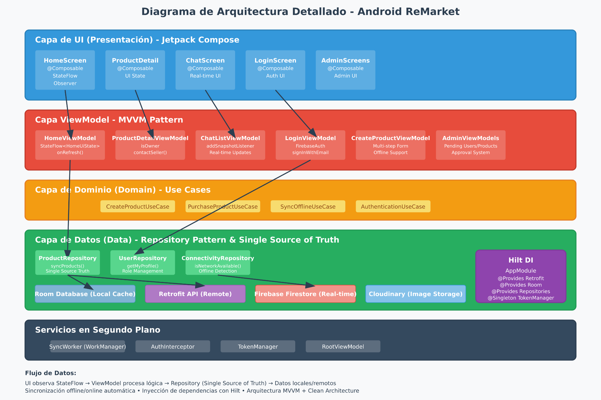

## 

### **4. Documentación Detallada de Funcionalidades (Android)**

A continuación se detalla cómo se implementan las funcionalidades clave
en el código de la aplicación.

#### **4.1. Autenticación y Gestión de Sesión**

El flujo de autenticación está diseñado para ser seguro y eficiente,
delegando la gestión de credenciales a Firebase.

- **Inicio de Sesión:** LoginViewModel utiliza la instancia de
  FirebaseAuth inyectada por Hilt para realizar el
  signInWithEmailAndPassword. Si el inicio de sesión es exitoso,
  solicita un **token JWT** a Firebase.

- **Gestión del Token:** Este token se almacena en TokenManager, una
  clase singleton que lo mantiene disponible durante la sesión del
  usuario.

- **Peticiones Autenticadas:** AuthInterceptor intercepta cada llamada
  de Retrofit, recupera el token de TokenManager y lo añade a la
  cabecera Authorization como Bearer \<token\>. Esto autentica al
  usuario en el backend de Flask.

- **Verificación de Rol y Navegación Inicial:** RootViewModel es el
  primer ViewModel que se ejecuta. Utiliza
  FirebaseAuth.AuthStateListener para detectar si hay un usuario
  logueado . Si lo hay, llama a userRepository.getMyProfile() para
  obtener su rol ("user" o "admin") y determina el destino de navegación
  inicial (NavigationTarget.Home o NavigationTarget.Admin) .

#### **4.2. Visualización y Sincronización de Productos (Online/Offline)**

La aplicación garantiza que el usuario siempre vea datos, incluso sin
conexión, gracias al patrón de Única Fuente de Verdad.

- **Observación de Datos:** La UI (HomeScreen) no llama directamente a
  la API. En su lugar, observa un  
  Flow\<Resource\<List\<Product\>\>\> expuesto por HomeViewModel.

- **Fuente de Verdad Local:** Este flujo proviene de ProductRepository,
  que a su vez lo obtiene de la base de datos Room
  (productDao.getProducts()). De este modo, la UI siempre muestra los
  datos cacheados localmente.

- **Sincronización:** Cuando el usuario realiza una acción de refresco
  (onRefresh en HomeViewModel ), se llama a
  productRepository.syncProducts(). Esta función:

1.  Obtiene la lista de productos actualizada de la API (  
    api.getProducts()).

2.  Borra solo los productos sincronizados previamente de la base de
    datos local (  
    dao.deleteSynced()), para no eliminar los que se crearon offline.

3.  Inserta los nuevos productos en Room (  
    dao.insertAll()).

4.  El Flow de Room emite automáticamente la nueva lista, y la UI se
    actualiza de forma reactiva.

#### **4.3. Creación y Edición de Productos (Online/Offline)**

Esta es una de las funcionalidades más complejas, diseñada para ser
resiliente a la falta de conexión.

- **Flujo de Creación:** El CreateProductViewModel recolecta los datos
  del producto a través de varios pasos. Al enviar, llama a  
  productRepository.createProduct().

- **Lógica Offline:** Dentro del repositorio, se verifica primero la
  conexión con connectivityRepository.isNetworkAvailable().

  - **Si hay conexión:** Las imágenes se suben a **Cloudinary**, se
    obtienen las URLs y se envían los datos a la API de Flask. El nuevo
    producto se guarda en Room.

  - **Si NO hay conexión:**

1.  Se genera un ID temporal para el producto (offline\_\<UUID\>).

2.  Las imágenes seleccionadas por el usuario (cuyas URIs son
    temporales) se copian al almacenamiento interno de la aplicación
    usando  
    copyUriToInternalStorage para asegurar su persistencia .

3.  Se crea una  
    ProductEntity en Room con los datos y las rutas locales de las
    imágenes, marcada con isSynced = false.

4.  Se agenda un trabajo de sincronización en segundo plano con  
    triggerOfflineSync().

- **Sincronización en Segundo Plano:**

  - SyncWorker es un CoroutineWorker gestionado por **WorkManager**. Se
    configura para ejecutarse solo cuando hay conexión a internet.

  - Su método  
    doWork() llama a productRepository.syncOfflineCreations(). Esta
    función recupera todos los productos con  
    isSynced = false de Room, sube sus imágenes (ahora desde el
    almacenamiento interno) a Cloudinary, y finalmente llama a la API de
    Flask para crear el producto en el servidor .

  - Una vez sincronizado, el producto local temporal se borra y se
    reemplaza por el producto real devuelto por el servidor.

#### **4.4. Sistema de Chat en Tiempo Real**

La funcionalidad de chat se implementa directamente con **Firebase
Firestore** para aprovechar sus capacidades en tiempo real.

- **Inicio de Conversación:** Desde ProductDetailViewModel, al contactar
  a un vendedor, se llama a la API de Flask (apiService.startOrGetChat).
  El backend se encarga de crear el documento del chat en la colección  
  chats de Firestore si no existe.

- **Visualización y Actualización:** ChatListViewModel y ChatViewModel
  utilizan addSnapshotListener de Firestore. Este método establece un
  "oyente" en la colección de chats o mensajes, de modo que cualquier
  cambio (un nuevo mensaje, una nueva conversación) es enviado
  inmediatamente a la aplicación sin necesidad de peticiones HTTP
  adicionales. Los datos recibidos actualizan el  
  StateFlow y la UI de Compose se recompone en tiempo real.

#### **4.5. Flujo de Compra y Venta**

El proceso de compra es una transacción gestionada por el backend para
garantizar la integridad de los datos.

- **Comprador:** PurchaseViewModel llama a
  repo.purchaseProduct(productId). Esto envía una petición al endpoint  
  /transactions del backend. El backend, de forma atómica, crea un
  documento de transacción y actualiza el estado del producto a
  "reserved".

- **Vendedor:** En ProductDetailViewModel, el vendedor (identificado por
  isOwner) puede confirmar la venta. Esto llama a  
  productRepository.markProductSold(pid), que a su vez contacta al
  endpoint  
  /products/{productId}/purchase. El backend cambia el estado del
  producto a "sold".

#### **4.6. Módulo de Administración (Aprobaciones y Reportes)**

Los ViewModels del administrador interactúan con endpoints y servicios
específicos para realizar sus tareas.

- **Aprobación de Usuarios/Productos:** AdminPendingUsersViewModel y
  AdminPendingProductsViewModel llaman a sus respectivos repositorios
  para obtener las listas de ítems pendientes (getPendingUsers,
  getPendingProductsFromFirebase). Al aprobar o rechazar, llaman a
  métodos de actualización como  
  setUserApproved o updateProductStatus, que modifican el campo
  correspondiente (approved o status) en el documento de Firestore.

- **Gestión de Reportes:** ManageReportsViewModel obtiene la lista de
  reportes desde IReportRepository. Para obtener detalles adicionales
  como el nombre del producto o el email del reportante, realiza
  llamadas directas a  
  ApiService.

## 

### **5. Documentación del Backend**

El backend, desarrollado con **Flask**, actúa como una capa de servicio
segura entre la aplicación cliente y la base de datos.

- **Propósito:** Su función principal es exponer una **API RESTful**
  para que la aplicación móvil interactúe con los datos. Centraliza la
  lógica de negocio y las validaciones de permisos, asegurando que un
  usuario no pueda modificar datos que no le pertenecen.

- **Tecnologías:** Utiliza **Flask** como framework web, **Firebase
  Admin SDK** para verificar los tokens de autenticación y para
  interactuar con **Firestore**, la base de datos NoSQL donde se
  almacenan todos los datos de la aplicación (usuarios, productos,
  etc.).

- **Estructura:** Está organizado en **Blueprints** para las rutas
  (product_routes, user_routes) y una capa de **Servicios**
  (product_service, user_service) que contiene la lógica de negocio,
  manteniendo el código limpio y modular.

## 

### **6. Diagrama de Arquitectura General (Sistema Completo)**

Este diagrama ilustra la interacción de alto nivel entre la aplicación
Android, el backend y los servicios en la nube.

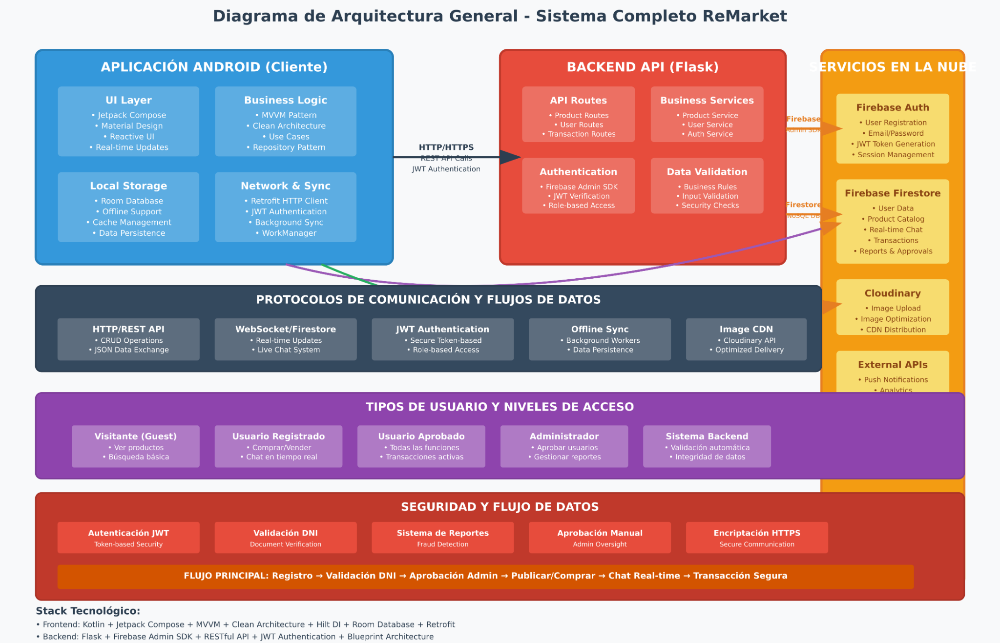

## **7. Manual de uso**

Este manual cubre todas las funcionalidades disponibles, desde la
exploración como visitante hasta la gestión de ventas, compras, y las
tareas administrativas.

## **8. Requisitos del Sistema**

Para garantizar una experiencia óptima, asegúrate de que tu dispositivo
cumpla con los siguientes requisitos:

- **Sistema Operativo:** Android 14 o superior.

- **Conexión a Internet:** Necesaria para el registro, inicio de sesión,
  sincronización de datos y la mayoría de las funcionalidades en tiempo
  real. La aplicación cuenta con funciones limitadas sin conexión.

## **9. Descarga e Instalación**

Puedes instalar ReMarket de dos maneras: a través del enlace de descarga
directa o compilando el proyecto desde su código fuente.

### Opción 1: Instalación Directa (Recomendado)

Este es el método más sencillo para usuarios finales.

1.  **Descargar el archivo:** Accede al siguiente enlace desde el
    navegador de tu dispositivo Android para descargar el archivo de
    instalación (.apk):

    https://drive.google.com/file/d/1X_92Lbuh9LH2r0Oy-s5D4eKpIUBOArNI/view?usp=sharing

2.  **Habilitar permisos:** Si es la primera vez que instalas una
    aplicación fuera de la Play Store, tu dispositivo te pedirá permiso
    para "instalar desde fuentes desconocidas". Acepta la solicitud para
    continuar.

3.  **Instalar la aplicación:** Abre el archivo .apk que descargaste
    (generalmente se encuentra en tu carpeta de "Descargas") y pulsa el
    botón **"Instalar"**. Una vez finalizado, podrás abrir ReMarket
    desde tu lista de aplicaciones.

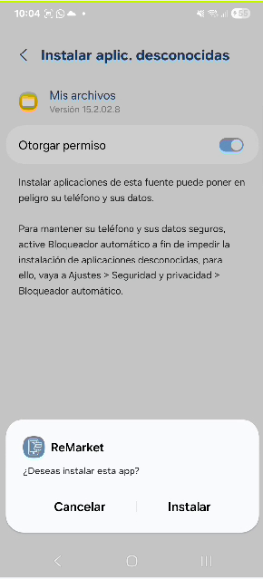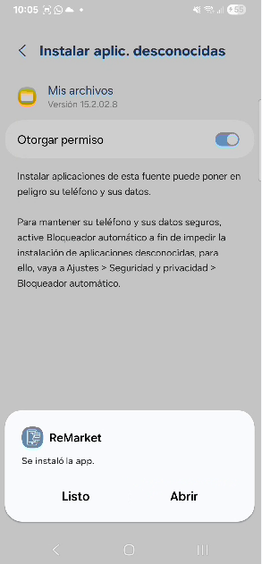

### Opción 2: Compilación desde el Código Fuente (Avanzado)

Este método está dirigido a desarrolladores o usuarios con conocimientos
técnicos.

1.  **Clonar el repositorio:** Descarga el código fuente desde el
    repositorio oficial del proyecto. Puedes hacerlo usando Git con el
    siguiente comando:

> git clone https://github.com/dhuamanilu/ReMarket.git

2.  **Abrir en Android Studio:** Inicia Android Studio y selecciona
    "Open an Existing Project". Navega hasta la carpeta donde clonaste
    el repositorio y ábrela.

3.  **Sincronizar dependencias:** Android Studio detectará la
    configuración del proyecto y comenzará a sincronizar las
    dependencias de Gradle automáticamente. Este proceso puede tardar
    unos minutos.

4.  **Compilar y ejecutar:** Una vez que la sincronización haya
    finalizado, puedes compilar y ejecutar la aplicación en un emulador
    de Android o en un dispositivo físico conectado a tu computadora.

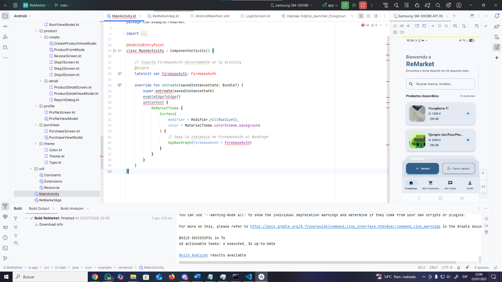

## **10. Primeros Pasos: Modo Visitante**

Al abrir la aplicación por primera vez, ingresarás en **Modo
Visitante**. No necesitas una cuenta para explorar los productos
disponibles.

### 10.1. Pantalla Principal (Home)

Podrás ver una lista de todos los productos que han sido aprobados por
un administrador.

- **Actualización de productos:** La lista se actualiza automáticamente.
  También puedes deslizar el dedo hacia abajo para refrescarla
  manualmente.

- **Búsqueda:** Utiliza la barra de búsqueda en la parte superior para
  filtrar productos por marca o modelo.

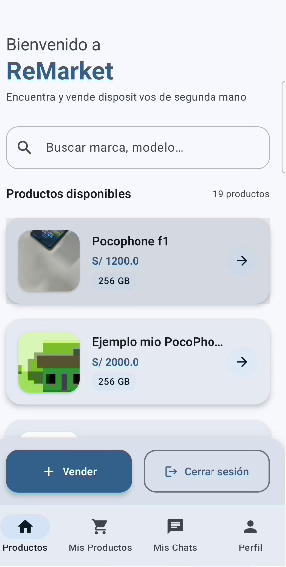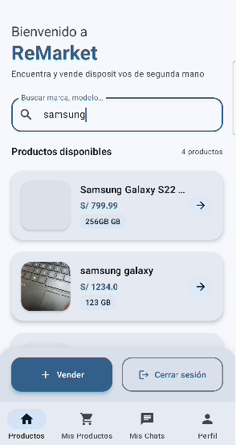

### 10.2. Ver Detalles de un Producto

Toca cualquier producto de la lista para ver su información completa. En
esta pantalla encontrarás:

- Fotografías del dispositivo.

- Marca, modelo y capacidad de almacenamiento.

- Precio.

- Descripción detallada del estado del producto.

- Nombre del vendedor.

- Indicación de si incluye la caja original.

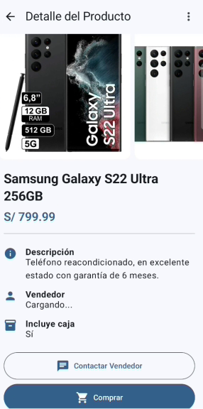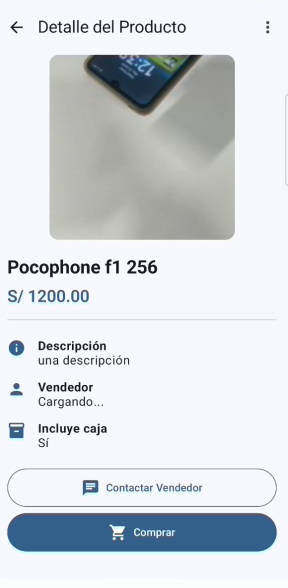

Como visitante, si intentas acceder a las pestañas

**"Mis Productos"**, **"Mis Chats"**, **"Perfil"** o intentas comprar un
producto, la aplicación te dirigirá a la pantalla de inicio de sesión.

## **11. Creación de Cuenta e Inicio de Sesión**

Para comprar, vender o interactuar con otros usuarios, necesitarás una
cuenta.

### 11.1. Registro de Nuevo Usuario

1.  En la pantalla de inicio de sesión, pulsa en  
    **"Regístrate"**.

2.  **Paso 1: Datos Personales.** Completa el formulario con tu nombre,
    apellidos, DNI y número de teléfono.

3.  **Paso 2: Verificación y Credenciales.** Sube una foto de la parte
    frontal y trasera de tu DNI, ingresa tu correo electrónico y crea
    una contraseña segura.

4.  Al finalizar, recibirás un mensaje de registro exitoso y serás
    redirigido a la pantalla de inicio de sesión.

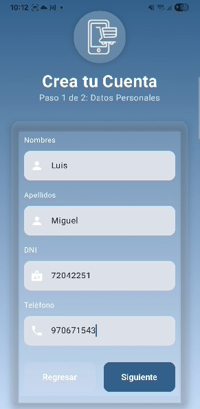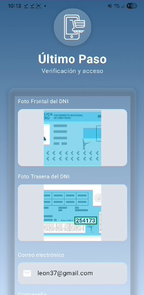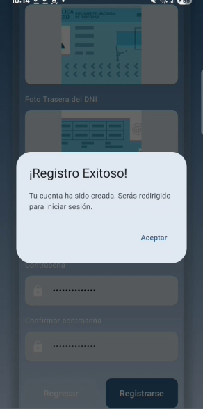

### 11.2. Inicio de Sesión

Ingresa tu correo y contraseña. A continuación, te proporcionamos
credenciales de prueba:

- **Usuario Cliente:**

  - **Correo:** cliente@gmail.com

  - **Contraseña:** cliente

- **Usuario Administrador:**

  - **Correo:** adminnu@gmail.com

  - **Contraseña:** Admin123

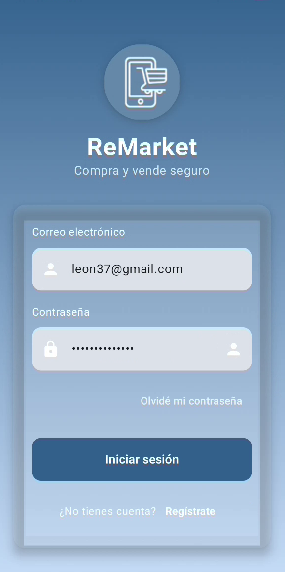

## **12. Funcionalidades para el Usuario Cliente**

Una vez que inicies sesión, tu cuenta deberá ser aprobada por un
administrador para acceder a todas las funciones.

### 12.1. Proceso de Aprobación de Cuenta

Inicialmente, tu cuenta estará restringida. No podrás comprar ni vender
productos. Puedes verificar el estado de tu cuenta en la pestaña

**"Perfil"**, donde verás si tu cuenta ha sido aprobada.

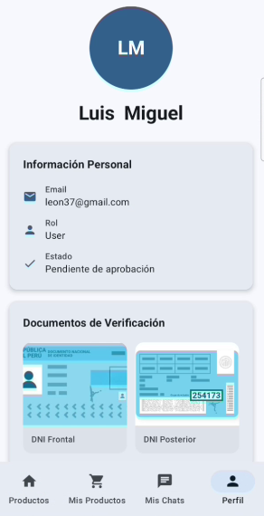

### 12.2. Navegación Principal

La barra de navegación inferior te da acceso a cuatro secciones
principales:

- **Productos:** La pantalla principal para explorar dispositivos.

- **Mis Productos:** Gestiona tus compras y ventas.

- **Mis Chats:** Accede a tus conversaciones con otros usuarios.

- **Perfil:** Consulta la información de tu cuenta.

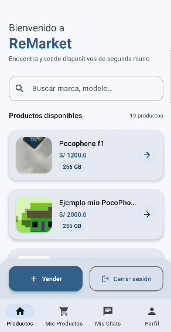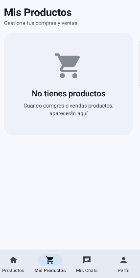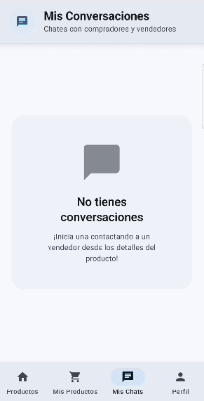

### 12.3. Vender un Producto

Una vez que tu cuenta sea aprobada por el administrador, podrás publicar
tus propios dispositivos.

1.  **Iniciar la Venta:** En la pestaña "Productos", pulsa el botón
    **"Vender"**.

2.  **Paso 1: Información Básica.** Ingresa la marca, modelo,
    almacenamiento y precio del dispositivo.

3.  **Paso 2: Detalles Adicionales.** Proporciona el código IMEI y una
    descripción detallada sobre el estado del producto.

4.  **Paso 3: Fotografías.** Sube al menos una foto del producto.
    Opcionalmente, puedes añadir fotos de la caja y de la factura de
    compra.

5.  **Enviar a Revisión:** Una vez completado, tu producto será enviado
    a un administrador para su aprobación. No será visible en la lista
    pública hasta ser aprobado.

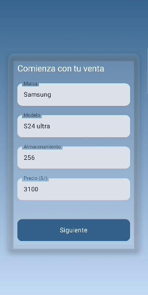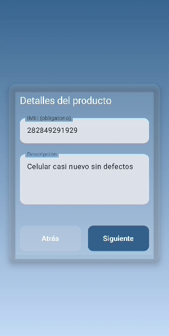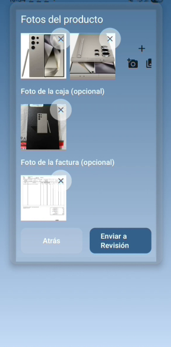

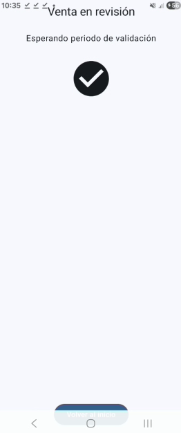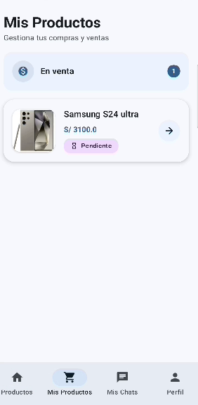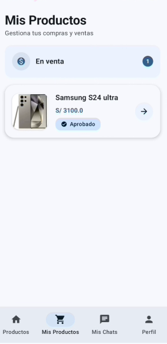

### 12.4. Gestionar Mis Publicaciones

En la pestaña **"Mis Productos"**, encontrarás dos secciones:

- **En Venta:** Aquí aparecen los productos que has publicado. Podrás
  ver su estado:

  - **En Revisión (Pending):** Esperando la aprobación del
    administrador.

  - **Aprobado (Approved):** Visible para todos los compradores.

  - **Reservado (Reserved):** Un comprador ha iniciado el proceso de
    compra.

  - **Vendido (Sold):** Has confirmado la venta del producto.

- **Comprados:** Aquí se listan los productos que has adquirido.

Desde esta pantalla, puedes tocar uno de tus productos "En Venta" para
**editar** su información (se precargarán los datos en el formulario) o
**eliminarlo** permanentemente.

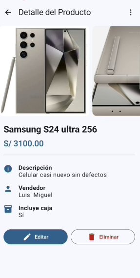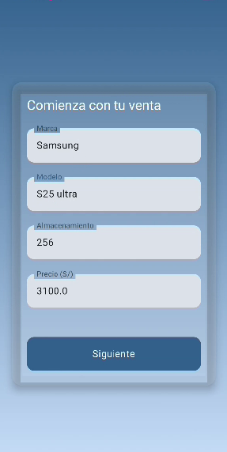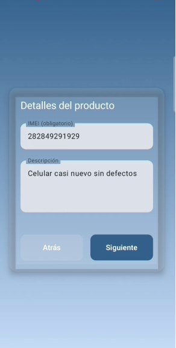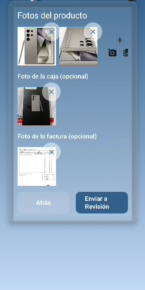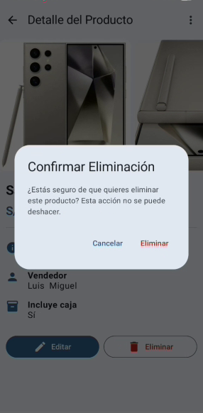

### 12.5. Comprar un Producto

Como comprador con una cuenta aprobada, tienes acceso a más
funcionalidades.

1.  **Contactar al Vendedor:** En la pantalla de detalle de un producto,
    pulsa **"Contactar Vendedor"** para iniciar una conversación directa
    y resolver tus dudas.

2.  **Comprar (Reservar):** Si estás decidido, pulsa el botón
    **"Comprar"**. Esto cambiará el estado del producto a  
    **"Reservado"** y creará una transacción. El producto ya no estará
    disponible para otros compradores.

3.  **Confirmar Venta (Vendedor):** Una vez reservado, el vendedor verá
    en la pestaña "Mis Productos" un botón para **"Confirmar Venta"**.
    Al pulsarlo, el estado del producto cambiará a  
    **"Vendido"**, finalizando la transacción.

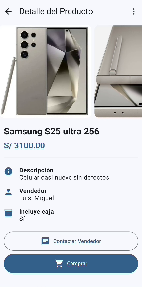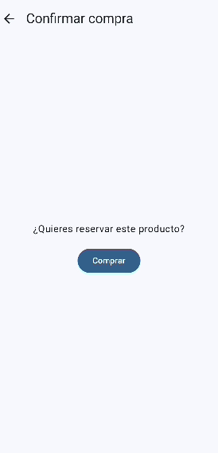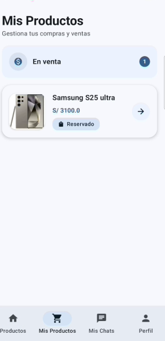

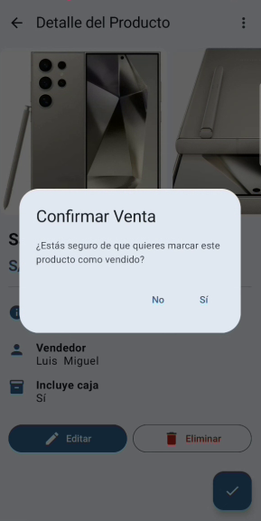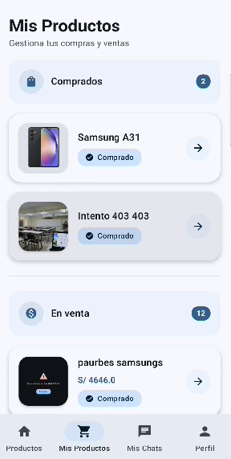

### 12.6. Gestionar Mis Chats

En la pestaña **"Mis Chats"**, verás una lista de todas las
conversaciones que has iniciado o recibido. Cada chat está asociado a un
producto específico, mostrando su foto y nombre para una fácil
identificación. Dentro de cada conversación, los mensajes se muestran
con fecha y hora.

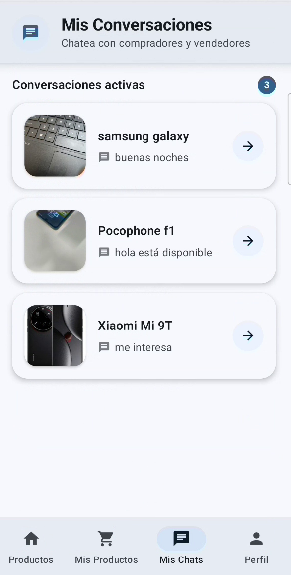

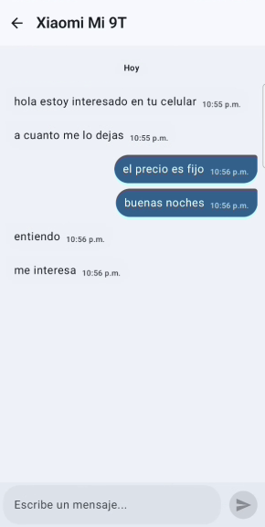

### 12.7. Reportar un Producto

Si encuentras un producto que consideras fraudulento o inapropiado,
puedes reportarlo desde su pantalla de detalle.

1.  Toca el menú de opciones (tres puntos verticales).

2.  Selecciona **"Reportar"**.

3.  Elige un motivo de la lista o describe el problema. El reporte será
    enviado a un administrador para su revisión.

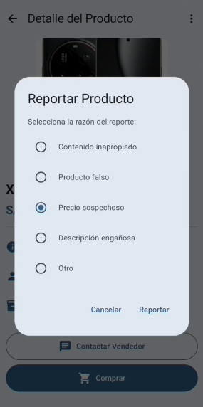

## **13. Funcionalidades para el Administrador**

Al iniciar sesión con credenciales de administrador, la interfaz cambia
para ofrecer herramientas de gestión.

- **Usuario Administrador:**

  - **Correo:** adminnu@gmail.com

  - **Contraseña:** Admin123

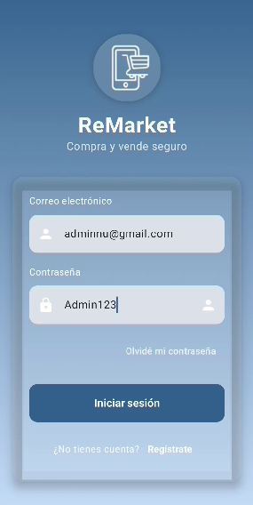

### 13.1. Navegación del Administrador

La barra de navegación inferior contiene tres secciones clave:

- **Aprobar Usuarios:** Gestiona las solicitudes de registro de nuevas
  cuentas.

- **Aprobar Productos:** Revisa y aprueba las publicaciones de los
  vendedores.

- **Reportes:** Atiende los reportes enviados por los usuarios. En la
  parte superior, encontrarás un botón para **"Salir"** y cerrar la
  sesión de administrador.

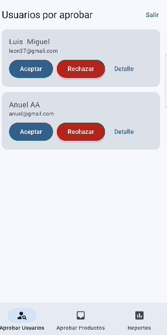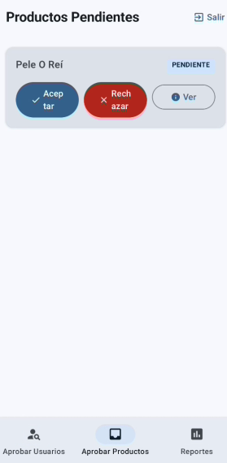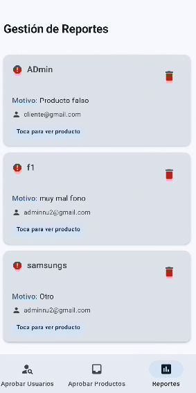

### 13.2. Aprobar Usuarios

En esta sección verás una lista de usuarios pendientes de aprobación,
mostrando su nombre y correo.

- **Acciones rápidas:** Puedes **Aceptar** o **Rechazar** la solicitud
  directamente desde la lista.

- **Ver Detalles:** Pulsa en **"Detalle"** para ver toda la información
  del usuario, incluyendo las fotos de su DNI, antes de tomar una
  decisión.

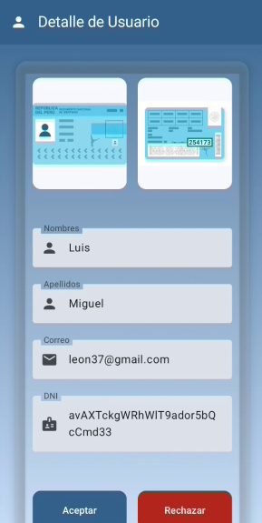

### 13.3. Aprobar Productos

Aquí se listan todos los productos que los vendedores han enviado a
revisión.

- Al igual que con los usuarios, puedes  
  **Aceptar** o **Rechazar** directamente.

- Pulsa en  
  **"Ver"** para acceder a la pantalla de detalle completa del producto,
  con todas sus fotos y datos, para tomar una decisión informada.

- Una vez que un producto es  
  **aprobado**, su estado cambia y se vuelve visible en la pantalla
  principal para todos los usuarios.

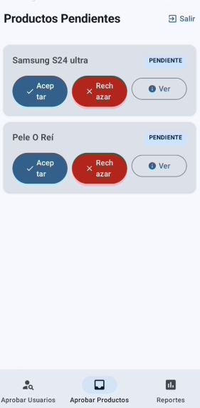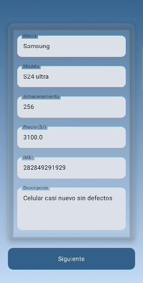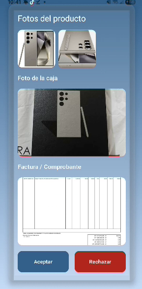

### 13.4. Gestionar Reportes

Esta sección muestra una lista de los productos que han sido reportados
por los usuarios. Para cada reporte, podrás ver:

- El producto reportado.

- El motivo del reporte.

- El correo del usuario que lo reportó. Tienes la opción de  
  **ver los detalles del producto** para investigar el caso o **eliminar
  el reporte** si consideras que no procede.

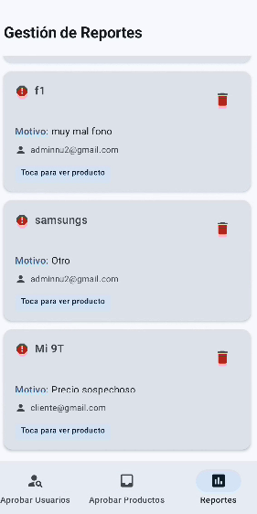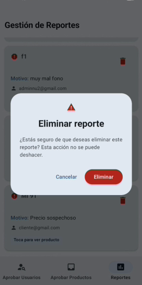

## **14. Funcionalidad Sin Conexión (Offline)**

ReMarket está diseñado para ofrecer funcionalidades clave incluso sin
conexión a internet.

- **Visualización de Productos:** Si abres la aplicación sin conexión,
  podrás ver la última lista de productos que fue sincronizada.

- **Publicar un Producto Offline:** Puedes completar todo el formulario
  para vender un producto sin conexión. La publicación se guardará
  localmente en tu dispositivo.

  - Las imágenes se guardan temporalmente desde el almacenamiento de tu
    teléfono.

  - En la pestaña "Mis Productos", la publicación aparecerá con la
    etiqueta  
    **"Pendiente de Sincronización"**.

- **Sincronización Automática:** En cuanto tu dispositivo recupere la
  conexión a internet, la aplicación sincronizará automáticamente tus
  publicaciones pendientes con el servidor. El estado cambiará a  
  **"En Revisión"**, y el proceso de aprobación del administrador
  comenzará. Esto ocurre en segundo plano, incluso si la aplicación está
  cerrada.

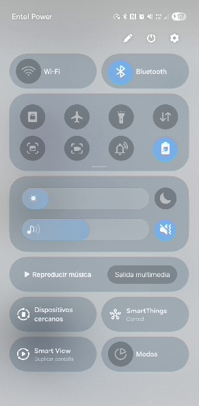
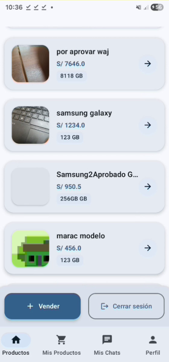
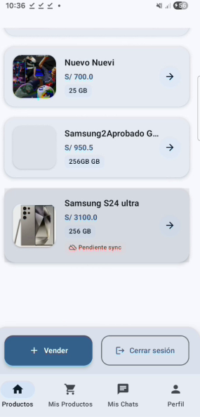

---
## Credenciales de Administrador
- **Usuario:** adminnu@gmail.com
- **Contraseña:** Admin123
  
## Credenciales de Cliente
- **Usuario:** cliente@gmail.com
- **Contraseña:** cliente
---

## Participación del equipo
| Integrante                          | % Participación |
|:------------------------------------|:---------------:|
| Azurin Zuñiga, Eberth Wilfredo      |       25 %      |
| Canal Mendoza, Fernando Rubén       |       25 %      |
| Galvez Quilla, Henry Isaías         |       25 %      |
| Huamani Luque, Diego Alonso         |       25 %      |
